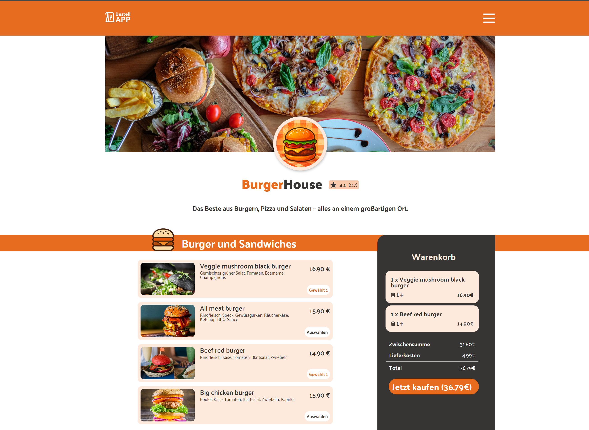

# BestellApp – BurgerHouse 🍔

A responsive food-ordering web app for a fictional restaurant ("BurgerHouse"), built with plain HTML, CSS and vanilla JavaScript – no framework, no build tools.

## Preview



## Features

- Menu with three categories: **Burgers & Sandwiches**, **Pizza**, **Salads**
- Add dishes to the basket, increase/decrease quantity, or remove them
- Live calculation of subtotal, delivery fee and total
- Responsive layout including a dedicated mobile basket (slide-in) and mobile navigation bar
- Order confirmation dialog after checkout
- No backend/database – dishes are rendered from a static JS data structure

## Project Structure

```
bestellapp/
├── index.html          # Entry point / markup
├── script.js            # App logic (rendering, basket, state)
├── style.css             # Base styling
├── styles/
│   ├── basket.css         # Basket styling
│   ├── fonts.css          # Font definitions
│   ├── mobile.css         # Responsive/mobile styles
│   └── variables.css      # CSS variables (colors, spacing, etc.)
├── scripts/
│   ├── db.js               # Static dish data (dishes array)
│   └── templates.js        # HTML templates (dish cards, basket items, etc.)
└── assets/
    ├── fonts/               # Font files
    ├── icons/                # SVG icons
    └── img/                   # Product and restaurant images

```

## Tech Stack

- **HTML5** – semantic markup
- **CSS3** – custom styling without a framework, responsive via `mobile.css`
- **Vanilla JavaScript (ES6+)** – no framework, no external dependencies
- No build pipeline, no package manager required

## Quick Start

Clone the repository:

```bash
git clone https://github.com/MichaGutDev/BestellApp.git
cd BestellApp
```

Since this is a static website, a simple local web server is enough:

```bash
# e.g. with VS Code Live Server, or:
npx serve .
```

Then open `index.html` or the displayed URL in your browser.

Alternatively, `index.html` can be opened directly in the browser.

## How It Works (Overview)

- `scripts/db.js` contains the static dish data (`dishes` array) with name, category, image, price and ingredients.
- `scripts/templates.js` generates the HTML snippets for dish cards, basket entries and the order summary.
- `script.js` manages the app state (`basketItems`), re-renders the menu and basket, and handles user interactions (add, change quantity, delete, checkout).
- The delivery fee is currently hard-coded as a constant (`DELIVERY_FEE = 4.99`) in `script.js`.

## License

> [!NOTE]
> This project is a practice project created for learning purposes. Images and icons under `assets/` may be subject to their own licenses/rights and are not necessarily covered by the MIT License below. "BurgerHouse" is a fictional restaurant name used for demonstration purposes only.

> [!IMPORTANT]
> See the [LICENSE](LICENSE) file for details.
